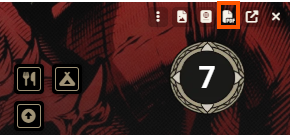
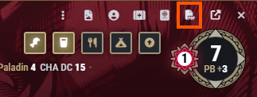
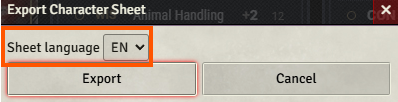
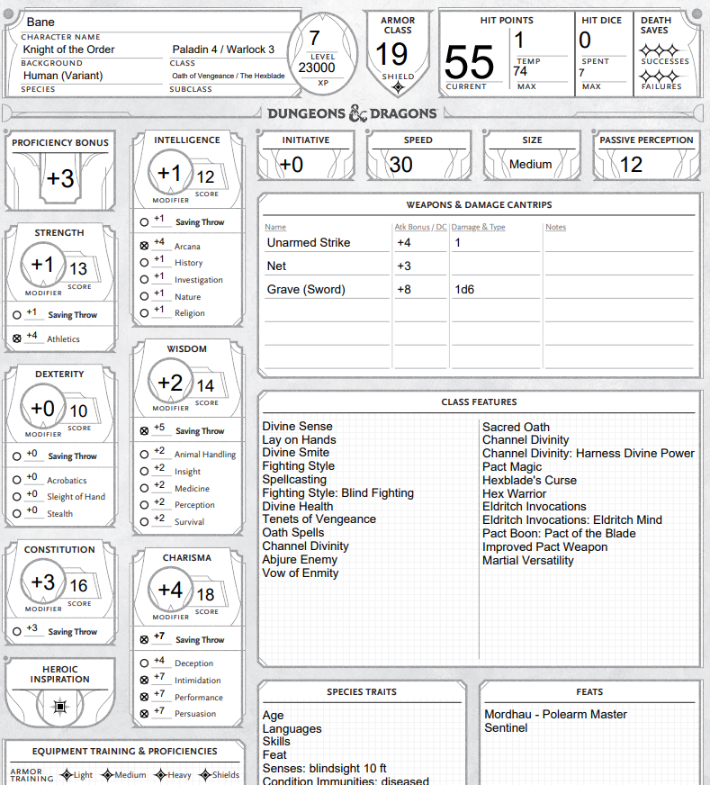
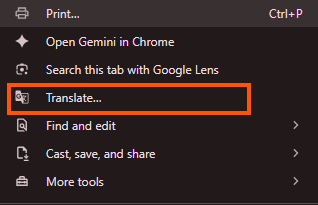
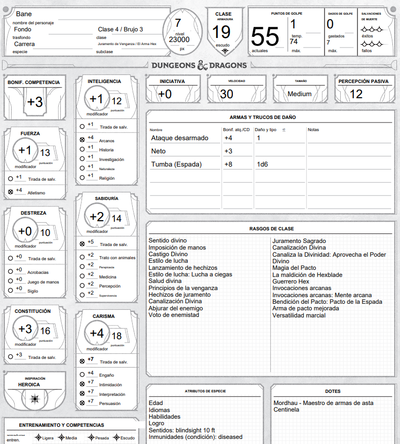

# D&D 5e PDF Character Sheet Exporter

   

Export your Foundry VTT character sheet to a fillable PDF — in **any language**, not just English.

## Requirements

- **Verified:** Foundry VTT 13.351 + dnd5e 5.3.3
- **Should also work:** Foundry v12+ with dnd5e v3.0+ (not personally verified)

## What it does

Adds an **Export PDF** button to the character sheet header. Click it, pick a language, and it downloads a filled-in PDF version of your character — ability scores, skills, spells, feats, equipment, all of it.

### Tidy 5e Sheets support

The button also shows up on [Tidy 5e Sheets](https://foundryvtt.com/packages/tidy5e-sheet) (both the classic and the modern/ApplicationV2 versions) — not just the native dnd5e character sheet.

## Installation

1. In Foundry, go to **Add-on Modules → Install Module**.
2. Paste this manifest URL:
   `https://raw.githubusercontent.com/Kaplar1208/dnd5e-pdf-exporter/refs/heads/main/module.json`
3. Enable it for your world.

## How to use it

1. Open a character sheet.
2. Click the **PDF icon** in the window's title bar.
3. Choose a language (English or Spanish, for now).

   

4. The PDF downloads automatically.

   

## Getting non-English names to show up correctly

The dnd5e system itself only stores item names (spells, feats, equipment...) in whichever language they were created in — usually English, even on a world set to another language. To get everything translated in the exported PDF:

1. Open the character sheet.
2. Turn on your browser's page-translation feature (e.g. Google Chrome's built-in "Translate this page") and let it fully finish translating.

   

3. **Wait a few seconds** for the translation to settle before exporting — if you export too quickly, some names may still be in English.
4. Click **Export PDF**.

The module reads whatever is currently shown on your screen, so it picks up the translation automatically. A small built-in glossary also fills in a handful of common terms as a backup, but it doesn't cover everything — the browser translation step above is what makes it work generally, for any character.

**Note:** For personality traits, ideals, bonds, and flaws, I recommend opening the tab on Foundry and just **wait a bit** after you see them translated by your browser.

## Known limitations

- Items stored inside a closed container (backpack, pouch) on the sheet won't be picked up by the translation step, since they're not visible on screen — they'll export in their original language.
- Some very version-specific fields (weapon attack/damage display, armor proficiency checkboxes) depend on your exact dnd5e version. If something exports blank, it's most likely a version-compatibility gap rather than lost data — nothing else is affected.
- Currently ships with English and Spanish sheet templates. Adding another language means providing your own fillable PDF for it.

## Changelog

### v0.2.1

- Fixed hardcoded Spanish labels ("Rasgos", "Ideales", "Vínculos", "Defectos", "Sentidos", "Resistencias", "Inmunidades", "Vulnerabilidades") showing up even when exporting in English. They now follow the export language like everything else.

### v0.2.0

- **Tidy 5e Sheets support**: the Export PDF button now appears on Tidy 5e Sheets (both the classic and the modern/ApplicationV2 versions), not just the native dnd5e character sheet.
- **Clearer compatibility info**: this README and `module.json` now distinguish what's actually verified (Foundry 13.351 + dnd5e 5.3.3) from what should also work but hasn't been personally tested (Foundry 12+ / dnd5e 3.0+).

## Credit

The bundled fillable PDF is a fan-made recreation of the official 5e (2024) character sheet and is not created or endorsed by Wizards of the Coast. TM & © Wizards of the Coast LLC.

## Support

Something not working? Open the browser console (F12) before exporting and check for lines starting with `dnd5e-pdf-exporter` — [open an issue](https://github.com/Kaplar1208/dnd5e-pdf-exporter/issues) with what you find there.
